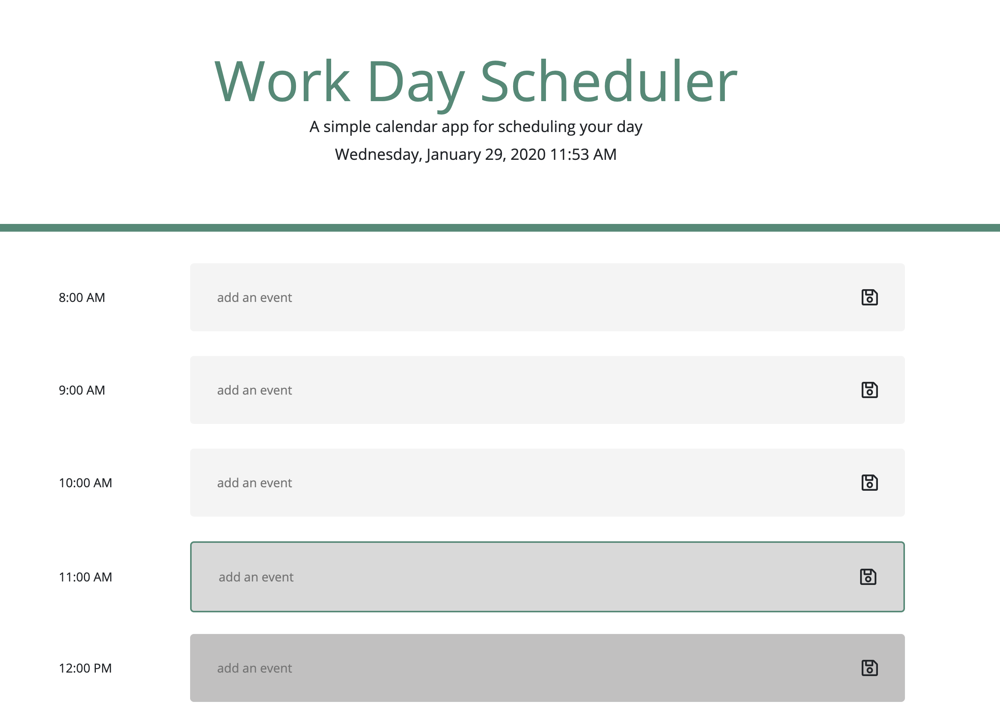

# Work Day Planner / [Demo](https://yarocruz.github.io/workday-scheduler/) 



## Description

This is a simple day planner web app. It presents the user with the current date and time at the top and a set of time blocks, from 8am to 5pm specifically, where the user can enter and save an event. The data gets saved to localStorage by either pressing enter or by clicking on the save icon. The styling for the time blocks are styled conditionally acording to the current time. If it's in the past, the background is a lighter gray. For the current hour the block has a darker gray with a green border. Finally for the future time blocks the background color is an even darker gray. 


## Technologies

This project uses [jQuery](https://jquery.com/) and [Moment.js](https://momentjs.com/). For CSS it's using Bootstrap.

## Problems / Solutions

I didn't have any major issues with this project. Using jQuery minimizes substantially having to set DOM selections to variables and Moment.js really makes it easier to work with Dates and Time. The biggest challenge for this project was making sure that when you're setting and getting items to localStorage you make sure that the data persists and stays on the correct input display. I used the switch conditional for this one.

``` js
for (let input of inputs) {
            if ($(input).val() !== null) {
                switch ($(input).attr('id')) {
                    case '8am':
                        $(input).val(localStorage.getItem('event8am'));
                        break;
                    case '9am':
                        $(input).val(localStorage.getItem('event9am'));
                        break;
                    case '10am':
                        $(input).val(localStorage.getItem('event10am'));
                        break;
                    case '11am':
                        $(input).val(localStorage.getItem('event11am'));
                        break;
                    case '12pm':
                        $(input).val(localStorage.getItem('event12pm'));
                        break;
                    case '1pm':
                        $(input).val(localStorage.getItem('event1pm'));
                        break;
                    case '2pm':
                        $(input).val(localStorage.getItem('event2pm'));
                        break;
                    case '3pm':
                        $(input).val(localStorage.getItem('event3pm'));
                        break;
                    case '4pm':
                        $(input).val(localStorage.getItem('event4pm'));
                        break;
                    case '5pm':
                        $(input).val(localStorage.getItem('event5pm'));
                        break;
                }
            }
        }
```

## Demo

See live demo [here](https://yarocruz.github.io/workday-scheduler/)

## License 

[MIT](/LICENSE)

Feel free to clone this repo and modify as you wish.
